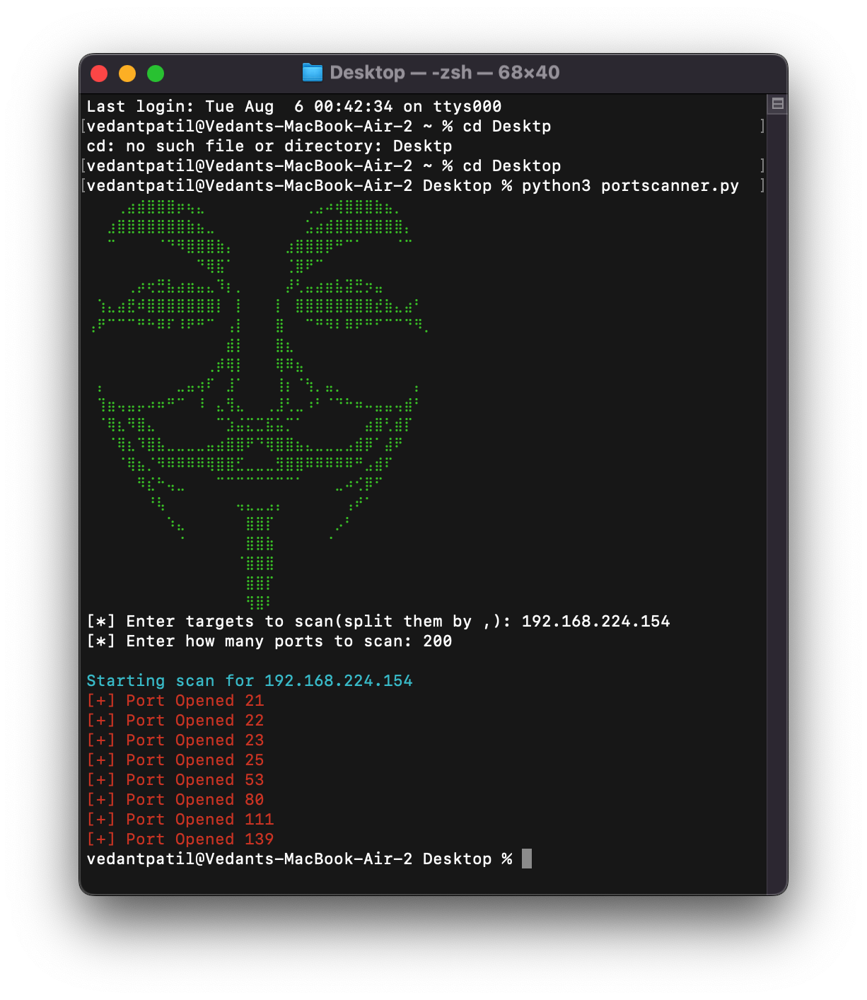

# Open Port Scanner

This Python script scans open ports on specified targets. It has been tested on a Metasploitable 2 virtual machine and executed from Kali Linux.

## Features

- **Multi-target Scanning**: Scan one or multiple targets by providing IP addresses.
- **Port Range Specification**: Define the range of ports to scan.
- **Colored Output**: Uses `termcolor` to display open ports in red for easy identification.
- **ASCII Art**: Includes ASCII art for a visually appealing terminal output.

## Requirements

- Python 3.x
- `termcolor` module

## Installation

1. **Clone the repository**:
   ```bash
   git clone https://github.com/vedant1717/Open-Port-Scanner.git
   cd Open-Port-Scanner
   ```

2. **Install the required module**:
   ```bash
   pip install termcolor
   ```

## Usage

1. **Run the script**:
   ```bash
   python portscanner.py
   ```

2. **Enter target(s) and port range**:
   - For a single target: `Enter targets to scan: 192.168.1.1`
   - For multiple targets: `Enter targets to scan: 192.168.1.1,192.168.1.2`
   - Define the number of ports to scan: `Enter how many ports to scan: 100`

### Example

**Input**:
```bash
[*] Enter targets to scan(split them by ,): 192.168.1.1,192.168.1.2
[*] Enter how many ports to scan: 100
```

**Output**:
```
Starting scan for 192.168.1.1
[+] Port Opened 22
[+] Port Opened 80
[+] Port Opened 443

Starting scan for 192.168.1.2
[+] Port Opened 21
[+] Port Opened 23
[+] Port Opened 80
```

## Screenshot



## License

This project is licensed under the MIT License - see the [LICENSE](LICENSE) file for details.
